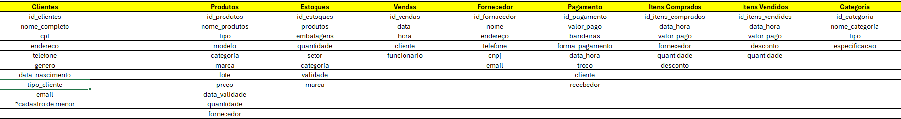
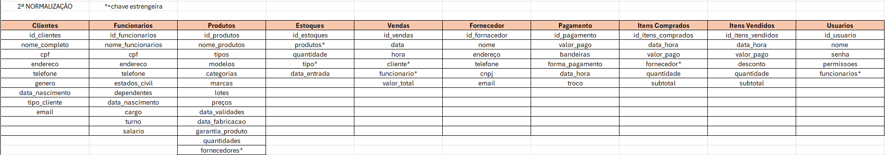
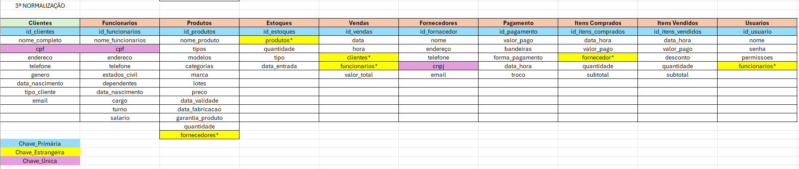
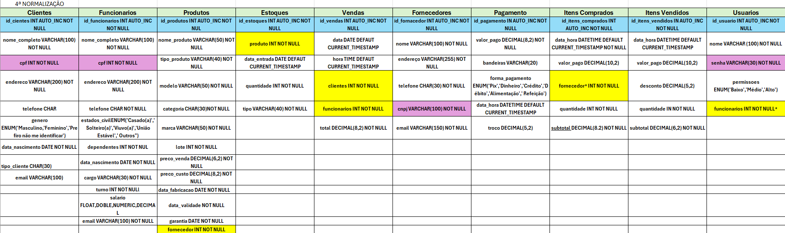
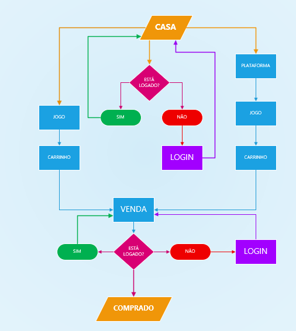
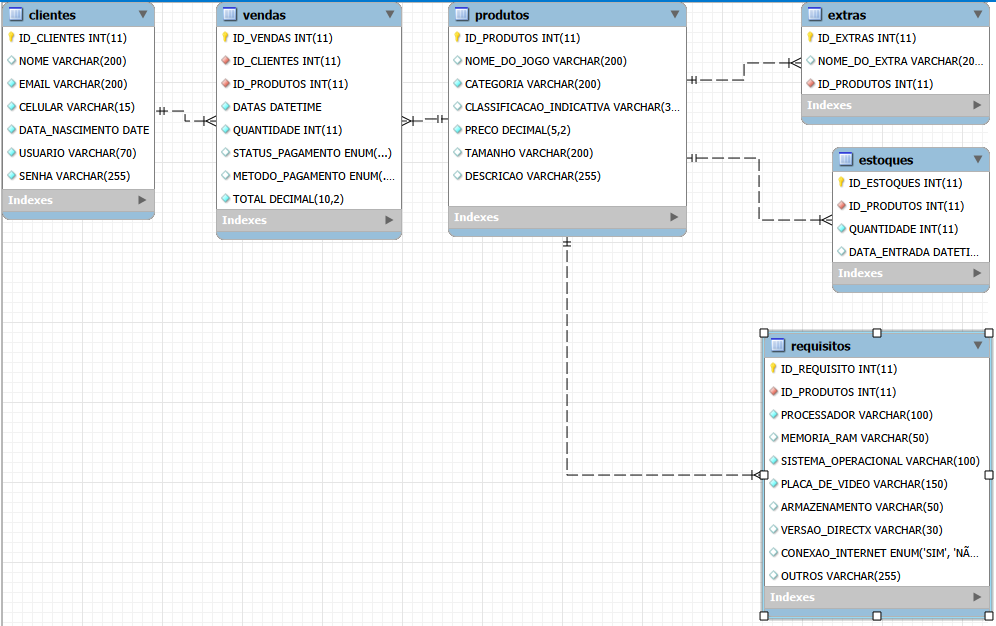
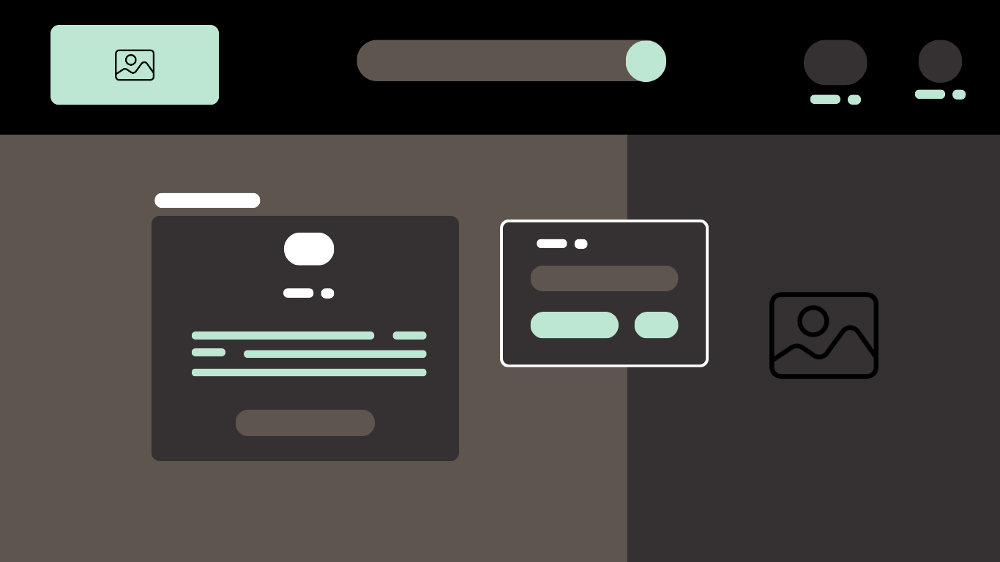

# PROJETO INTEGRADOR (PI) - TURMA 3 2026

#  NOSSO SITE  - "MEDIEVAL GAMING"

## 🧠 PROJETO DESENVOLVIDO POR:
*   ABNER [ABNERNUNIS](https://github.com/Abner2812)
*   PEDRO [PEDRO BEZERRA](https://github.com/pedro-bezerra-da-silva)
*   EDUARDO [EDUARDO MODE](https://github.com/kayqueFranco)
*   VITOR [VITOR](https://github.com/kayqueFranco)

## Colaboradores

<table>
  <tr>
    <td align="center">
      <a href="https://www.linkedin.com/in/abner-nunis-35b261371//" target="_blank">
        <br>
        <sub><b>ABNER</b></sub>
      </a>
    </td>
    <td align="center">
      <a href="https://github.com/pedro-bezerra-da-silva/" target="_blank">
        <br>
        <sub><b>PEDRO</b></sub>
      </a>
    </td>
    <td align="center">
      <a href="https://www.linkedin.com/in/lucas-henrique-0148422b2/" target="_blank">
        <br>
        <sub><b>EDUARDO</b></sub>
      </a>
    </td>
    <td align="center">
      <a href="https://www.linkedin.com/in/nathan-furukawa/" target="_blank">
        <br>
        <sub><b>VITOR</b></sub>
      </a>
    </td>
  </tr>
</table>

## OBJETIVO DO SITE:

#### INTERAGIR COM OS USUÁRIOS DE JOGOS PARA OFERECER PRODUTOS RELACIONADOS AOS MELHORES JOGOS DO MERCADO COM MAIS PRATICIDADE MAIS ACESSIVEIS E BARATOS.

--- 
## 🌟 Objetivo do Projeto

* Oferecer uma plataforma digital onde o usuário possa ter acesso a informações e serviços relacionados a jogos.
* Comprar jogos digitalmente.
* Ter uma experiência de compra simplificada e segura.
* Ter acesso mais fácil a jogos de qualidade, com preços competitivos e uma interface amigável.

---

## 👥 Público-Alvo

* Pessoas interessadas em jogos online.
* Estudantes, trabalhadores e qualquer pessoa que deseje jogar e interagir com mundo dos gamers de forma simples e digital.
* Jogadores entusiastas que buscam uma plataforma confiável para adquirir jogos e interagir com outros jogadores.

# ⚙️Levantamento do Bancos de Dados


## Tabelas

### Mais Importantes
*   Clientes
*   Produtos
*   Vendas
*   Estoques

### Menos Importantes
*   Histórico de Vendas
*   Plataformas
*   Categorias de Jogos
*   Itens do Carrinho
*   Usuários

## 🔄 Normalizações

Abaixo estão as etapas de normalização do banco de dados, aplicadas para garantir integridade, evitar redundância e melhorar a organização dos dados, seguindo as Formas Normais.

### 🔹 Normalização 1 (1FN)



### 🔹 Normalização 2 (2FN)



### 🔹 Normalização 3 (3FN)



### 🔹 Normalização 4 (4FN)



## Relacionamentos (Fluxograma da Pagina Web)


## Modelo Lógico (DER)



## 🧱Modelo Físico (SQL)
```sql
CREATE DATABASE IF NOT EXISTS VendasJogos;
USE VendasJogos;

-- Tabela CLIENTES
CREATE TABLE CLIENTES (
    ID_CLIENTES INT AUTO_INCREMENT PRIMARY KEY,
    NOME VARCHAR(200),
    EMAIL VARCHAR(200) NOT NULL UNIQUE KEY,
    CELULAR VARCHAR(15) NOT NULL,
    DATA_NASCIMENTO DATE NOT NULL,
    USUARIO VARCHAR(70) NOT NULL,
    SENHA VARCHAR(255) NOT NULL UNIQUE KEY
);
/*
ATUALIZAÇÃO(05/03/2026): Tabela de produtos
- alterado o tipo da coluna descricao de: varchar(255) -> text.
- adicionado 'NOT NULL' nas seguintes colunas: tamanho, descricao, classificacao_indicativa. 
*/
-- Tabela PRODUTOS
CREATE TABLE PRODUTOS (
    ID_PRODUTOS INT AUTO_INCREMENT PRIMARY KEY,
    NOME_DO_JOGO VARCHAR(200),
    CATEGORIA VARCHAR(200) NOT NULL,
    CLASSIFICACAO_INDICATIVA VARCHAR(30) NOT NULL,
    PRECO DECIMAL(5,2) NOT NULL,
    TAMANHO VARCHAR(200) NOT NULL,
    DESCRICAO TEXT 
);

/*
ATUALIZAÇÃO(03/05/2026): Tabela de vendas
	removidos os itens da tabela: id_clientes, id_produtos, quantidade, preco_unitario, 
*/
-- Tabela VENDAS
CREATE TABLE VENDAS (
    ID_VENDAS INT AUTO_INCREMENT PRIMARY KEY,
    -- ID_CLIENTES INT NOT NULL,
	-- ID_PRODUTOS INT NOT NULL,
    DATAS DATETIME NOT NULL DEFAULT CURRENT_TIMESTAMP(),
    -- HORA TIME NOT NULL DEFAULT CURRENT_TIMESTAMP(),
    -- QUANTIDADE INT NOT NULL,
    STATUS_PAGAMENTO ENUM('PAGO','PENDENTE','CANCELADO','EM PROCESSAMENTO'),
    METODO_PAGAMENTO ENUM('CRÉDITO','PIX'),
    TOTAL DECIMAL(10,2) NOT NULL
    -- FOREIGN KEY (ID_CLIENTES) REFERENCES CLIENTES(ID_CLIENTES),
    -- FOREIGN KEY (ID_PRODUTOS) REFERENCES PRODUTOS(ID_PRODUTOS)
);

/*
ATUALIZAÇÃO(03/05/2026): Adicionar uma nova tabela chamada de 'vendas_detalhes'
	Itens da tabela: id_vendas_detalhes, id_vendas, id_clientes, id_produtos, quantidade, preco_unitario, 
*/


-- Tabela ESTOQUES
CREATE TABLE ESTOQUES (
    ID_ESTOQUES INT AUTO_INCREMENT PRIMARY KEY,
    ID_PRODUTOS INT NOT NULL,
    QUANTIDADE INT NOT NULL,
    DATA_ENTRADA DATETIME DEFAULT CURRENT_TIMESTAMP,
    FOREIGN KEY (ID_PRODUTOS) REFERENCES PRODUTOS(ID_PRODUTOS)
);

-- Tabela EXTRAS
CREATE TABLE EXTRAS (
    ID_EXTRAS INT AUTO_INCREMENT PRIMARY KEY,
    NOME_DO_EXTRA VARCHAR(200),
    ID_PRODUTOS INT NOT NULL,
    FOREIGN KEY (ID_PRODUTOS) REFERENCES PRODUTOS(ID_PRODUTOS)
);

-- Tabela REQUISITOS
CREATE TABLE REQUISITOS (
    ID_REQUISITO INT AUTO_INCREMENT PRIMARY KEY,
    ID_PRODUTOS INT NOT NULL,
    PROCESSADOR VARCHAR(100) NOT NULL,
    MEMORIA_RAM VARCHAR(50),
    SISTEMA_OPERACIONAL VARCHAR(100) NOT NULL,
    PLACA_DE_VIDEO VARCHAR(150) NOT NULL,
    ARMAZENAMENTO VARCHAR(50),
    VERSAO_DIRECTX VARCHAR(30),
    CONEXAO_INTERNET ENUM('SIM','NÃO'),
    OUTROS VARCHAR(255),
    FOREIGN KEY (ID_PRODUTOS) REFERENCES PRODUTOS(ID_PRODUTOS)
);
```

## 🛠️PROGRAMAS UTILIZADOS

### **Backend:**
* **Node.js:** Ambiente de execução JavaScript.
* **Express.js:** Framework web para Node.js, para construção das APIs RESTful.
* **MySQL2:** Driver para conexão e interação com o banco de dados MySQL.
* **Multer:** Middleware para Node.js para manipulação de `multipart/form-data`, usado no upload de arquivos (fotos de perfil).
* **CORS:** Middleware para habilitar o Cross-Origin Resource Sharing.
* **Path:** Módulo nativo do Node.js para manipulação de caminhos de arquivo.
* **Dotenv:** Módulo para carregar variáveis de ambiente de um arquivo `.env`.
* **WS (WebSocket):** Biblioteca para implementação de comunicação em tempo real (chat).

### **Frontend:**

* **PHOTSHOP:** Wireframe e Modelagem da página.
* **HTML5:** Estrutura das páginas web.
* **CSS3:** Estilização e design responsivo da interface do usuário.
* **JavaScript (Vanilla JS):** Lógica interativa do lado do cliente, requisições de API (`fetch`), manipulação dinâmica do DOM, cálculo de idades.

### **Banco de Dados:**
* **MySQL:** Sistema de gerenciamento de banco de dados relacional.

## 🧑‍💻 DESENVOLVIMENTO

### Backend
* Configuração do ambiente Node.js e instalação das dependências.
* Criação do banco de dados MySQL e definição das tabelas.
* Implementação das rotas RESTful para clientes, produtos, vendas, estoques, histórico de vendas, plataformas, categorias de jogos, itens do carrinho e usuários.
* Implementação da funcionalidade de upload de fotos de perfil usando Multer.
         
### Frontend
* Desenvolvimento da interface do usuário usando HTML5 e CSS3.
* Implementação da lógica interativa usando JavaScript, incluindo requisições de API para o backend, manipulação do DOM e cálculo de idades.
* Criação de páginas para cadastro,
login, visualização de produtos, carrinho de compras.
### Banco de Dados
* Criação do banco de dados e definição das tabelas com os relacionamentos adequados.
* Inserção de dados de teste para clientes, produtos, vendas, estoques, histórico de
vendas, plataformas, categorias de jogos, itens do carrinho e usuários.

## 🧪 TESTES

* Testes unitários para as rotas do backend usando ferramentas como Jest ou Mocha.
* Testes de integração para verificar a comunicação entre o frontend e o backend.
* Testes de usabilidade para garantir que a interface do usuário seja intuitiva e fácil de usar.
* Testes de carga para avaliar o desempenho do sistema sob diferentes condições de uso.

## 🚀 DEPLOYMENT
* Configuração do ambiente de produção para o backend (por exemplo, usando Heroku ou AWS).
* Configuração do ambiente de produção para o frontend (por exemplo, usando Netlify ou Vercel).
* Configuração do banco de dados em um serviço de hospedagem (por exemplo, usando Amazon RDS ou Google Cloud SQL).
* Implementação de práticas de segurança, como uso de HTTPS, proteção contra ataques de injeção SQL e autenticação segura.

## 📈 MONITORAMENTO E MANUTENÇÃO
* Monitoramento do desempenho do sistema usando ferramentas como New Relic ou Datadog.
* Implementação de um sistema de logs para rastrear erros e atividades do usuário.
* Atualizações regulares para corrigir bugs, melhorar a segurança e adicionar novas funcionalidades com base no feedback dos usuários.
* Suporte ao cliente para resolver problemas e responder a perguntas dos usuários.

## 📊 ANÁLISE DE DADO
* Coleta de dados de uso do sistema para entender o comportamento dos usuários e identificar áreas de melhoria.
* Análise de dados para otimizar a experiência do usuário e aumentar as vendas.
* Implementação de ferramentas de análise, como Google Analytics, para monitorar o tráfego do site e o comportamento dos usuários.

# 📄 ESTRUTURA DO NOSSO SITE

## WIREFRAMES
### Wireframes das principais páginas do site, mostrando a estrutura e o layout planejados para cada seção.

#### 1. Página Inicial do Site / 2.Plataforma do Jogo / 3.Informações do Jogo.
<tr>
    <td>1
        
    </td>
    <td>2
        
    </td>
    <td>3
        
    </td>
</tr>

#### 4 Página de Login do Site;


#### 5 Página de Compra do Jogo.



#
* Link do site: https://medieval-gaming.netlify.app/


* Link do repositório:
### Telas Iniciais e Navegação

Visualizações da página principal da aplicação, mostrando diferentes layouts ou conteúdos.

* **`pagina_inicial.png`**
    [](./img/pagina_inicial.png)
    A primeira visualização da aplicação após o login ou acesso inicial.

* **`pagina_inicial2.png`**
    [](./img/pagina_inicial2.png)
    Uma variação ou diferente estado da página inicial.

* **`pagina_inicial3.png`**
    [](./img/pagina_inicial3.png)
    Outra variação da página principal, possivelmente com diferentes elementos ou destaque.

* **`pagina_inicial4.png`**
    [](./img/pagina_inicial4.png)
    Mais uma visualização da página inicial, mostrando a evolução do design ou conteúdo.

### Perfil e Listagem

Telas dedicadas à visualização e gestão de perfis.

* **`perfil_idoso.png`**
    [](./img/perfil_idoso.png)
    Página de visualização detalhada do perfil de um idoso, exibindo suas informações e necessidades.

* **`listar_idosos.png`**
    [](./img/listar_idosos.png)
    Interface que apresenta uma lista ou carrossel de idosos disponíveis para interação.

* **`editar_perfil.png`**
    [](./img/editar_perfil.png)
    Formulário para o usuário realizar alterações em seu próprio perfil cadastrado.

### Outras Telas Úteis

Telas que apoiam funcionalidades específicas da plataforma.

* **`pagina_msg.png`**
    [](./img/pagina_msg.png)
    Interface de chat ou sistema de mensagens para comunicação entre usuários.

* **`pagina_salvo.png`**
    [](./img/pagina_salvo.png)
    Uma tela de confirmação, geralmente exibida após uma ação bem-sucedida (ex: cadastro, edição).


```    

## 🎯 CONCLUSÃO
O projeto "Medieval Gaming" tem como objetivo criar uma plataforma de comércio eletrônico para jogos, oferecendo uma experiência interativa e acessível para os usuários. Com um backend robusto, um frontend intuitivo e um banco de dados bem estruturado, o sistema visa atender às necessidades dos clientes e proporcionar uma experiência de compra agradável. A implementação de testes, deployment e monitoramento garantirá a qualidade e a manutenção contínua do sistema, enquanto a análise de dados permitirá otimizar a experiência do usuário
e aumentar as vendas. O sucesso do projeto dependerá da colaboração eficaz entre a equipe de desenvolvimento e do feedback dos usuários para aprimorar continuamente a plataforma.


